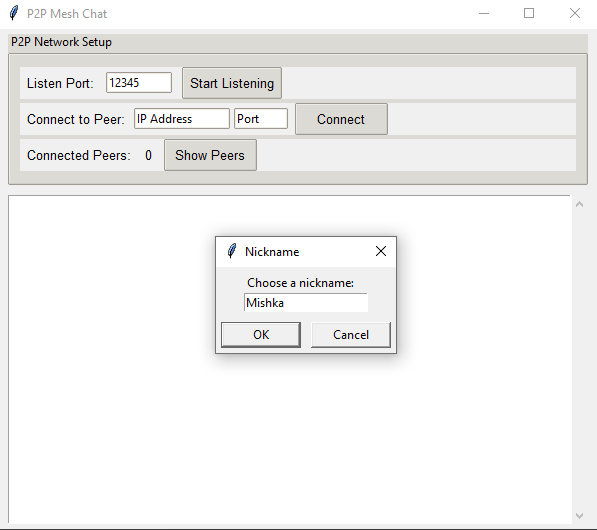
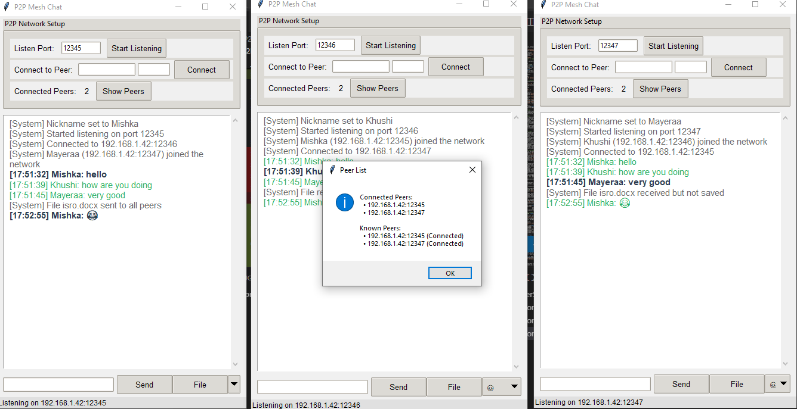
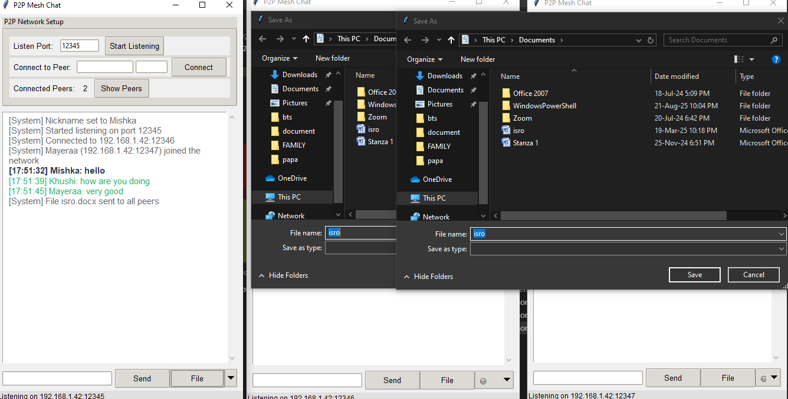
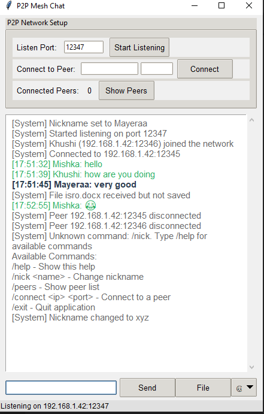

# P2P Mesh Chat

A decentralized peer-to-peer chat application built with Python and Tkinter. This application creates a true mesh network where peers communicate directly with each other without requiring a central server.

## 📸 Screenshots & Demo

### Application Interface
The clean, user-friendly interface showing the P2P network setup and chat functionality:


*Initial application window with nickname setup*

### Network Topology View
The peer list showing connected and known peers in the mesh network:


*Network topology display showing connected peers and their status*

### File Transfer Feature
Demonstration of file transfer capabilities across the peer-to-peer network:


*File transfer in progress with save dialog*

### Command System & Help
Built-in command system with comprehensive help for network management:


*Help system showing available slash commands*

## Features

### Core P2P Functionality
- **True Mesh Network**: Each peer can connect directly to other peers
- **Decentralized Architecture**: No central server required
- **Message Flooding**: Messages propagate through the network with loop prevention
- **Automatic Peer Discovery**: Learn about other peers when connecting to the network
- **Dynamic Network**: Peers can join and leave at any time

### Chat Features
- **Real-time Messaging**: Instant message delivery across the mesh
- **Nickname Support**: Set and change your display name
- **File Transfer**: Send files directly between peers
- **Emoji Support**: Express yourself with emojis
- **Command System**: Built-in slash commands for network management

### User Interface
- **Clean GUI**: User-friendly Tkinter interface
- **Connection Management**: Easy peer connection setup
- **Network Monitoring**: View connected peers and network status
- **Message History**: Scrollable chat with color-coded messages

## Getting Started

### Prerequisites
- Python 3.7 or higher
- tkinter (usually included with Python)

### Installation
1. Clone or download this repository
2. Ensure Python is installed on your system
3. Run the application:
   ```bash
   python main.py
   ```

### Basic Usage

#### 1. Start the Application
```bash
python main.py
```

#### 2. Set Up Your Node
1. Choose a nickname when prompted
2. Set your listening port (default: 12345)
3. Click "Start Listening"

#### 3. Connect to the Network
- **To connect to an existing peer**: Enter their IP address and port, then click "Connect"
- **To have others connect to you**: Share your IP address and port with them

#### 4. Start Chatting
- Type messages and press Enter
- Use `/help` to see available commands
- Click "File" to send files to all connected peers

## Available Commands

- `/help` - Show available commands
- `/nick <name>` - Change your nickname
- `/peers` - Show list of connected and known peers
- `/connect <ip> <port>` - Connect to a peer
- `/exit` - Quit the application

## Network Architecture

### How It Works
The application creates a mesh topology where each peer can connect to multiple other peers. Messages are broadcast through the network using a flooding algorithm with loop prevention.

### Message Types
- **Chat Messages**: Regular text messages with timestamps
- **Nickname Changes**: Broadcast when users change their display names
- **File Transfers**: Base64-encoded files sent through the network
- **Peer Discovery**: Share known peer lists when connecting

### Security Features
- **Message Loop Prevention**: Uses unique message IDs to prevent infinite loops
- **Connection Management**: Automatic cleanup of failed connections
- **Input Validation**: Proper handling of malformed message

## Technical Details

### Protocol
- **Transport**: TCP sockets for reliable communication
- **Message Format**: JSON with length prefixes
- **File Transfer**: Base64 encoding for binary data
- **Threading**: Non-blocking GUI with separate network threads

## Troubleshooting

### Connection Issues
- Ensure firewall allows the application
- Check that ports are not already in use
- Verify IP addresses are correct
- Try different ports if default is blocked

### Performance Considerations
- Message flooding scales with network size
- File transfers use base64 encoding (larger than binary)
- Each peer maintains all connections directly

## Contributing

This is an educational implementation of P2P mesh networking. Contributions and improvements are welcome!

## License

This project is open source and available under the MIT License.
